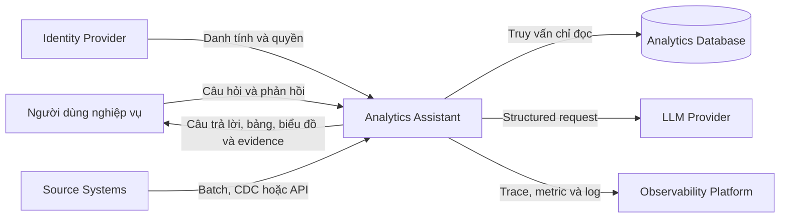
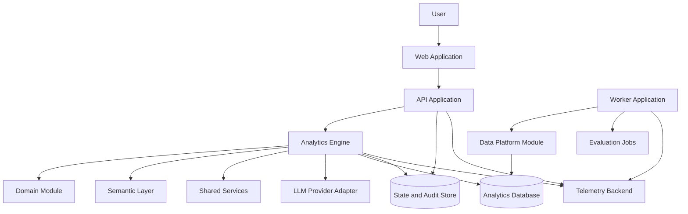
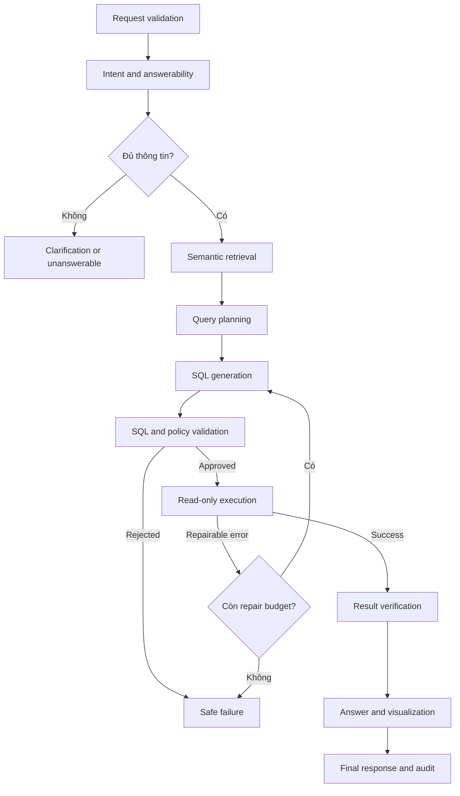

# System Architecture

## 1. Mục đích

Tài liệu mô tả kiến trúc của hệ thống Semantic Text-to-SQL cho dữ liệu chuỗi cung ứng và tồn kho. Hệ thống tiếp nhận câu hỏi bằng ngôn ngữ tự nhiên, chuyển câu hỏi thành kế hoạch truy vấn có ngữ nghĩa, sinh và kiểm tra SQL, thực thi với quyền chỉ đọc, sau đó trả kết quả cùng bằng chứng truy vết.

Vertical slice đầu tiên là supplier delivery performance; inventory status là lát cắt mở rộng kế tiếp. Kiến trúc vẫn giữ ranh giới module tổng quát nhưng không giả định phải hỗ trợ nhiều domain trong MVP.

Tài liệu này xác định ranh giới hệ thống, trách nhiệm của các thành phần, hợp đồng trao đổi dữ liệu và các thuộc tính chất lượng cần được bảo vệ trong quá trình phát triển.

## 2. Mục tiêu kiến trúc

- Công thức KPI được quản lý tập trung và có phiên bản.
- SQL chỉ được thực thi sau khi vượt qua kiểm tra cú pháp, ngữ nghĩa và quyền truy cập.
- Database phục vụ truy vấn sử dụng tài khoản chỉ đọc và quyền tối thiểu.
- Workflow có trạng thái, giới hạn retry và điều kiện dừng rõ ràng.
- Mỗi câu trả lời có thể truy vết tới metric, filter, khoảng thời gian, SQL và phiên bản dữ liệu liên quan.
- Các phụ thuộc như LLM, database và framework được đặt sau interface để có thể thay thế.
- Chất lượng được đo ở từng bước thay vì chỉ dựa vào việc SQL có chạy thành công hay không.

## 3. Phạm vi

### Trong phạm vi

- Câu hỏi lookup, ranking, comparison và trend;
- Semantic metric, dimension, filter, time range và grain;
- Clarification cho câu hỏi mơ hồ;
- Hội thoại follow-up có trạng thái;
- SQL generation, validation và read-only execution;
- Result verification, insight mô tả và visualization;
- Audit, feedback, evaluation, latency và cost tracking.

### Ngoài phạm vi hiện tại

- Ghi hoặc thay đổi dữ liệu nghiệp vụ;
- Tự động thực hiện hành động trên hệ thống bên ngoài;
- Tự động định nghĩa KPI không có phê duyệt;
- Suy luận quan hệ nhân quả từ dữ liệu mô tả;
- Truy vấn tự do trên toàn bộ data warehouse;
- Forecasting hoặc prescriptive analytics chưa có model và evaluation riêng;
- Huấn luyện foundation model, fine-tuning hoặc reinforcement learning trong phạm vi triển khai hiện tại.

## 4. Nguyên tắc thiết kế

### Semantic-first

LLM không nhận toàn bộ schema thô và không tự tạo công thức KPI. Câu hỏi được ánh xạ sang metric, dimension, filter, time range, grain và join path đã được quản lý trước khi tạo SQL.

### Deterministic controls

LLM được dùng cho các tác vụ cần hiểu hoặc sinh ngôn ngữ. Authorization, SQL policy, resource limit, metric formula và result checks được thực hiện bằng code hoặc database policy.

### Pretrained-model first

Hệ thống dùng model đã được huấn luyện sẵn qua provider adapter, prompting, retrieval và structured output. Model là dependency có thể thay thế; domain knowledge nằm trong semantic catalog, glossary, approved joins và evaluation fixtures. Training hoặc fine-tuning không phải điều kiện để hoàn thành các gate hiện tại.

### Least privilege

Mỗi service và người dùng chỉ được truy cập phần dữ liệu cần thiết. Quyền truy cập được áp dụng trước context retrieval và tiếp tục được thực thi ở database.

### Bounded workflow

Workflow có số lần repair hữu hạn, request deadline và stop reason. Policy error và permission error là lỗi kết thúc, không được gửi lại cho LLM để sửa.

### Evidence by default

Kết quả phải gắn với các artifact đã dùng để tạo ra nó. Evidence không thay thế kiểm chứng, nhưng giúp người dùng và kỹ sư tái lập quyết định của hệ thống.

### Versioned contracts

API schema, workflow state, metric, prompt, SQL policy và evaluation dataset đều có phiên bản. Thay đổi không tương thích phải có migration hoặc version mới.

## 5. System context



Các hệ thống bên ngoài, giao thức kết nối và nhà cung cấp cụ thể phải được xác nhận bằng ADR trước khi triển khai production.

## 6. Container view



## 7. Deployable units

| Thành phần | Vị trí | Trách nhiệm |
|---|---|---|
| Web application | `apps/web/` | Giao diện hỏi đáp, clarification, bảng, biểu đồ, evidence và feedback |
| API application | `apps/api/` | Authentication context, request validation, API contract và workflow entrypoint |
| Worker application | `apps/worker/` | Ingestion, transformation, evaluation và scheduled jobs |

Các deployable unit không chứa bản sao riêng của metric formula hoặc SQL policy.

## 8. Module boundaries

| Module | Vị trí | Trách nhiệm | Không chịu trách nhiệm |
|---|---|---|---|
| Domain | `packages/domain/` | Entity, value object, policy và interface nghiệp vụ | HTTP, database driver, SDK LLM |
| Semantic layer | `packages/semantic_layer/` | Metric, dimension, glossary, catalog và approved joins | Authorization enforcement cuối cùng |
| Analytics engine | `packages/analytics_engine/` | Orchestration, retrieval, planning, SQL, execution và insight | Định nghĩa KPI mới |
| Data platform | `packages/data_platform/` | Ingestion, transformation, quality và lineage | Trả lời request tương tác |
| Shared | `packages/shared/` | Config, logging, tracing, errors và adapters | Business rules đặc thù |

Dependency giữa module phải hướng qua public interface. Domain không phụ thuộc framework hoặc infrastructure implementation.

## 9. Request lifecycle



### Trạng thái kết thúc

| Trạng thái | Ý nghĩa |
|---|---|
| `completed` | Kết quả đã được thực thi và kiểm tra |
| `needs_clarification` | Thiếu thông tin có ảnh hưởng tới kết quả |
| `unanswerable` | Không có metric hoặc dữ liệu phù hợp |
| `policy_rejected` | Yêu cầu vi phạm quyền hoặc SQL policy |
| `execution_failed` | Lỗi không thể sửa hoặc hết repair budget |
| `budget_exceeded` | Vượt deadline, token, cost hoặc database budget |

## 10. Data contracts

Các bước trao đổi object có schema, version và validation; không truyền dictionary tùy ý giữa các module.

| Contract | Producer | Consumer | Nội dung chính |
|---|---|---|---|
| `RequestEnvelope` | API | Intent router | Câu hỏi gốc, identity scope, session, locale, timezone |
| `IntentPlan` | Intent router | Semantic retrieval | Intent, entity hints và answerability |
| `ClarificationRequest` | Intent router | Web/API | Câu hỏi làm rõ và lựa chọn hợp lệ |
| `GroundingContext` | Semantic retrieval | Query planner | Metric, schema, approved joins và source IDs |
| `SemanticQueryPlan` | Query planner | Generator/validator | Metric, dimensions, filters, time, grain, sort và limit |
| `SQLCandidate` | SQL generator | SQL validator | SQL, parameters, dialect và plan mapping |
| `ValidatedSQL` | SQL validator | Execution controller | SQL đã duyệt, policy version và resource estimate |
| `QueryResult` | Execution controller | Result verifier | Typed columns, rows, count, duration và checksum |
| `VerifiedAnalysis` | Result verifier | Answer layer | Dataset đã kiểm tra, findings, warnings và freshness |
| `FinalResponse` | Answer layer | API/Web | Answer, chart/table và evidence |
| `AuditEvent` | Mọi stage | Audit store | Version, timing, decision và sanitized metadata |

Contract phải có backward-compatibility policy trước khi hỗ trợ resume conversation qua nhiều phiên bản deployment.

## 11. Semantic layer

Mỗi metric cần có:

- Tên, mô tả, owner, status và version;
- Base fact và base grain;
- Formula hoặc dependency tới metric khác;
- Time dimension;
- Allowed dimensions và approved joins;
- Default filters;
- Null và zero-denominator policy;
- Unit và display format;
- Classification và freshness requirement;
- Test cases và effective date.

Metric catalog là nguồn sự thật cho công thức KPI. Prompt và code UI chỉ tham chiếu metric bằng ID/version.

## 12. Conversation state

State lưu các giá trị đã được xác nhận trong hội thoại:

```json
{
  "session_id": "<id>",
  "metric": "<metric_id>",
  "metric_version": "<version>",
  "dimensions": [],
  "filters": [],
  "time_range": null,
  "output_grain": [],
  "assumptions": [],
  "last_request_id": "<id>"
}
```

Follow-up chỉ kế thừa field có semantics rõ. Khi câu hỏi mới xung đột với state cũ, giá trị mới được ưu tiên và thay đổi phải xuất hiện trong evidence.

## 13. SQL validation và execution

### Validation pipeline

1. Parse SQL theo dialect thành AST.
2. Từ chối multi-statement.
3. Chỉ chấp nhận statement type được policy cho phép.
4. Kiểm tra schema, table, column và function allowlist.
5. Đối chiếu metric, filters, time field, group-by và limit với semantic plan.
6. Chạy dry-run hoặc `EXPLAIN` khi database hỗ trợ.
7. Trả kết quả validation có error code và `repairable` flag.

### Execution controls

- Dedicated database role;
- Read-only transaction;
- Statement timeout và request deadline;
- Row/result-size limit;
- Connection pool limit;
- Query cost guard khi hỗ trợ;
- Không dùng owner hoặc superuser account;
- Không cho phép temporary object, function hoặc extension nếu không cần.

Database privilege là lớp kiểm soát cuối cùng. SQL parser và prompt guard chỉ là defense-in-depth.

## 14. Result verification

Trước khi tạo câu trả lời, hệ thống kiểm tra:

- Output schema và data type;
- Uniqueness của output grain;
- Empty result và null ratio;
- Value range và denominator;
- Sorting, top-k và comparison period;
- Data freshness;
- Sự tồn tại của mọi số liệu được đưa vào phần diễn giải.

Các phép tính xác định như percentage change, contribution và ranking được thực hiện bằng SQL hoặc code, không giao cho LLM tính từ bảng dữ liệu dài.

## 15. Security model

### Trust boundaries

- User input là dữ liệu không tin cậy;
- Retrieved documentation và sample values có trust level;
- LLM output là đề xuất không tin cậy;
- SQL chỉ trở thành executable artifact sau validation;
- Database và identity policy là enforcement boundary;
- Rendered Markdown, chart tooltip và export file cũng thuộc bề mặt rò rỉ dữ liệu.

### Required controls

- Authentication và authorization trước retrieval;
- Table/column allowlist và row/tenant scope;
- Parameter binding cho literal phù hợp;
- Input/output sanitization;
- Không đưa token, secret hoặc connection string vào prompt/log;
- Redaction trước khi export telemetry;
- Audit cho policy decision và execution;
- Adversarial tests cho injection, exfiltration và privilege bypass.

## 16. Reliability và failure handling

- Mỗi external call có timeout;
- Retry chỉ áp dụng cho lỗi transient và nằm trong request budget;
- Repair SQL mặc định tối đa hai lần;
- Cùng một error signature không được lặp vô hạn;
- Dependency failure không được chuyển thành câu trả lời có số liệu giả;
- Mỗi failure trả `request_id`, status và safe error message;
- Workflow phải hỗ trợ cancellation và idempotency tại các điểm có retry.

Các ngưỡng timeout, row limit, token và cost được cấu hình theo environment và phê duyệt qua ADR/operations review.

## 17. Observability và audit

Mỗi request có root trace; từng stage tạo child span. Telemetry tối thiểu gồm:

- Latency và status theo stage;
- Model/prompt version, token và cost;
- Metric và semantic catalog version;
- SQL hash, policy version và validator result;
- Row count, result checksum và freshness;
- Repair attempt và stop reason;
- Redaction decision.

Không log full result hoặc raw prompt mặc định. Retention và quyền đọc audit log được định nghĩa trong tài liệu operations.

## 18. Deployment view

Kiến trúc hỗ trợ các environment local, test, staging và production. Mỗi environment có credential, database role, audit namespace và telemetry namespace riêng.

Deployment target, orchestration platform, network topology, identity provider và secret manager chưa được chọn. Các lựa chọn này cần ADR và threat review trước production.

## 19. Testing strategy

| Test level | Phạm vi |
|---|---|
| Unit | Metric formula, time parser, planner rules, AST policy và result checks |
| Integration | API, semantic catalog, database, LLM adapter và telemetry |
| Contract | Compatibility giữa các contract version |
| End-to-end | Question tới final response trên versioned data |
| Evaluation | Metric selection, semantic plan, SQL/result equivalence và clarification |
| Security | Injection, restricted object, scope bypass, expensive query và leakage |
| Regression | Model, prompt, metric, schema, policy hoặc dialect change |

Execution accuracy không đủ để đánh giá business correctness. Báo cáo phải tách lỗi intent, retrieval, planning, generation, validation, execution và presentation.

## 20. Repository mapping

```text
apps/
  api/
  web/
  worker/
packages/
  domain/
  semantic_layer/
  analytics_engine/
  data_platform/
  shared/
db/
  migrations/
  schema/
  policies/
tests/
evals/
configs/
infra/
docs/
```

Chi tiết implementation nằm trong README của từng package. Nếu thay đổi layout hoặc deployable boundary, cần cập nhật phần này và tạo ADR tương ứng.

## 21. Quyết định cần ADR

- Backend/API framework;
- Frontend framework;
- LLM provider và failover strategy;
- Analytics database và SQL dialect;
- Custom semantic catalog hoặc semantic platform;
- State/audit storage và retention;
- Workflow code thuần hoặc orchestration framework;
- Deployment platform và topology;
- Authentication/authorization model;
- Release quality và security gates.

Danh sách và trạng thái được quản lý trong `docs/decisions/`.

## 22. Rủi ro kiến trúc

| Rủi ro | Biện pháp kiểm soát chính |
|---|---|
| Chọn sai metric | Metric catalog, owner review, semantic plan và evidence |
| Join sai grain | Approved joins, cardinality test và result verification |
| Schema quá lớn | Context retrieval và schema pruning |
| Prompt injection | Trust boundaries, least privilege và deterministic validation |
| Data leakage | Access scope, classification, redaction và audit |
| Repair loop | Max attempts, error signature và request budget |
| Model/provider drift | Versioning, regression eval và adapter boundary |
| Dữ liệu cũ | Freshness contract, warning và operational alert |
| Chi phí/latency cao | Stage telemetry, context/result limits và cost budget |

## 23. Open questions

- Persona chính và ranh giới chi tiết của vertical slice supplier delivery là gì?
- Nguồn dữ liệu, owner và classification cụ thể ra sao?
- Metric nào được phê duyệt cho MVP?
- Database và SQL dialect nào là target?
- Người dùng nào được xem SQL hoặc raw rows?
- SLO về latency, availability, freshness và quality là gì?
- Audit/conversation/result phải lưu trong bao lâu?
- Deployment và compliance constraints là gì?

## 24. Future work — model training và fine-tuning

Training, supervised fine-tuning, preference optimization hoặc execution-aware reinforcement learning chỉ được đưa vào phạm vi khi đồng thời có:

- Baseline training-free đã đạt Gate C/D và có release manifest tái lập được;
- Failure taxonomy cho thấy lỗi còn lại đến từ model capability, không phải metric contract, retrieval, schema, prompt, validator hoặc dữ liệu;
- Dataset question/plan/SQL/error đã được owner review, có quyền sử dụng và không chứa dữ liệu nhạy cảm ngoài policy;
- Evaluation set độc lập, chống leakage và có tiêu chí so sánh quality, security, latency và cost;
- Compute budget, vận hành model, rollback và model-version governance được phê duyệt bằng ADR.

Future work này không thay thế semantic layer, AST/policy validation, read-only execution hoặc result verification. Model đã fine-tune vẫn phải đi qua cùng workflow và release gate.

## 25. Standards và tài liệu tham khảo

- [C4 Model](https://c4model.com/) — biểu diễn system context, container và component.
- [Architectural Decision Records](https://adr.github.io/) — quản lý quyết định và rationale.
- [NIST AI Risk Management Framework](https://www.nist.gov/itl/ai-risk-management-framework) — quản trị rủi ro hệ thống AI.
- [OWASP LLM Prompt Injection Prevention](https://cheatsheetseries.owasp.org/cheatsheets/LLM_Prompt_Injection_Prevention_Cheat_Sheet.html) — trust boundary và defense-in-depth cho LLM.
- [OWASP SQL Injection Prevention](https://cheatsheetseries.owasp.org/cheatsheets/SQL_Injection_Prevention_Cheat_Sheet.html) — parameterization, allowlist và least privilege.
- [OpenTelemetry](https://opentelemetry.io/docs/concepts/signals/) — traces, metrics và logs.
