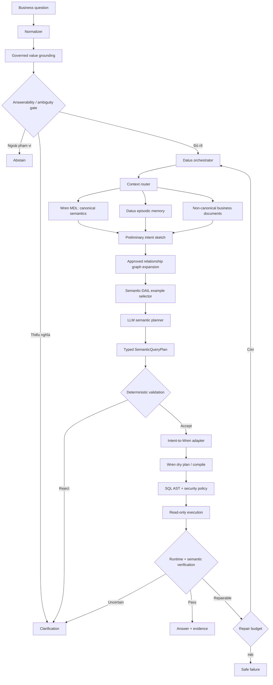

# Kiến trúc Wren + Datus cho EV Analytics

Status: Accepted for MVP direction  
Updated: 2026-09-15  
Scope: Customer360, Vehicle360, battery health, charging station/session và service history

## 1. Nguồn yêu cầu được giữ nguyên

Ba artifact sau là context đầu vào, không phải file triển khai và không được sửa khi cập nhật kiến trúc:

- [`docs/main_docs/week1.md`](../main_docs/week1.md): cốt lõi Week 1 về research, data, 15+ câu hỏi, ground truth, baseline và một vòng cải tiến;
- [`docs/lab_requirement.md`](../lab_requirement.md): north star cho telemetry EV, Bronze/Silver/Gold, DQ gate, trip/features, ML và train/serve parity;
- [`docs/vitai-architecture-map.html`](../vitai-architecture-map.html): bản đồ hệ thống ViTAI, hot/cold path và các sản phẩm Vehicle360/Customer360/Mobility360.

MVP hiện tại chỉ hiện thực lát cắt analytics read-only. Nó không tuyên bố đã triển khai Kafka, Lakehouse, Spark, MLflow, Airflow hay pipeline range estimation đầy đủ.

## 2. Quyết định cốt lõi

- **Wren là semantic authority mục tiêu:** metric, dimension, relationship và SQL access plan có một nguồn sự thật duy nhất trong MDL/Wren Engine.
- **Datus là orchestration authority mục tiêu:** phân rã nhiệm vụ, quản lý context, episodic memory, clarification và bounded repair.
- **Không duy trì Dosi và Wren cho cùng một domain.** Khi nối Datus với Wren, Datus phải gọi Wren qua custom semantic adapter/tool; memory của Datus chỉ lưu cách giải và feedback, không sao chép công thức KPI.
- **Hai paper vẫn nằm trong kiến trúc:** Semantic-Layer-Mediated Agent là backbone; DAIL-SQL được chuyển thành `Semantic-DAIL`, chọn ví dụ theo question skeleton + semantic-plan skeleton trước khi sinh plan, không dùng để bỏ qua semantic layer và sinh SQL tự do.
- **LLM quyết định ý định; Wren quyết định physical access.** SQL từ model không được xem là executable authority.

## 3. Luồng đích



## 4. Vai trò từng lớp

| Lớp | Authority | Trách nhiệm | Không được làm |
|---|---|---|---|
| Normalizer/gate | Code + policy | Chuẩn hóa ngôn ngữ, nhận diện thiếu metric/time/value, abstain | Tự chọn KPI mơ hồ |
| Preliminary sketch | Rule/small model | Dự đoán operator, metric family, dimension count và time/filter shape để retrieval | Sinh SQL vật lý hoặc trở thành final plan |
| Datus | Workflow state | Orchestrate, retrieve, nhớ episode, repair hữu hạn | Trở thành nguồn metric thứ hai |
| Wren MDL/Engine | Semantic contract | Metric, dimension, relationship, access plan, compile/dry plan | Dùng memory hội thoại làm KPI |
| Value index | Governed metadata | Map alias như “Hà Nội” → value chuẩn trong scope | Chứa PII hoặc value ngoài quyền |
| Semantic-DAIL | Reviewed examples | Chọn few-shot theo cấu trúc câu hỏi và plan | Sao chép raw SQL bất kể metric version |
| LLM planner | Untrusted proposal | Sinh typed semantic intent/plan | Thực thi SQL hoặc phát minh formula |
| Validator/executor | Code + DB policy | Kiểm tra plan, SQL, quyền, timeout, result | Repair lỗi policy/permission |

## 5. Kiến trúc MVP trong repository

Wren và Datus chưa phải dependency runtime của repository. Để có baseline tái lập từ Week 1, MVP dùng các implementation cục bộ sau interface tương lai:

| Target component | Baseline hiện có | Đường dẫn |
|---|---|---|
| Wren MDL/catalog | Repository-owned metric/dimension JSON | `packages/semantic_layer/` |
| Wren compiler | Deterministic PostgreSQL compiler | `packages/analytics_engine/sql_generation/` |
| Datus planner | Deterministic Vietnamese rule baseline | `packages/analytics_engine/planning/` |
| Typed intent | `SemanticQueryPlan` v1.0 | `packages/domain/query_contracts.py` |
| Gold marts | PostgreSQL semantic views | `db/migrations/0002_*`, `0004_*` |
| Evaluation memory/examples | 16 reviewed question/plan cases | `evals/datasets/ev_customer_v1.jsonl` |
| Vietnamese normalizer + gate | Deterministic B1 components | `packages/analytics_engine/language/`, `planning/gates.py` |
| Governed value index | Non-PII alias/value catalog | `packages/semantic_layer/value_index.py`, `values/` |
| Preliminary sketch + Semantic-DAIL | Structure-aware reviewed-example selector | `packages/analytics_engine/retrieval/` |
| Traced context pipeline | B1 stages feeding the deterministic B0 planner | `packages/analytics_engine/planning/architecture_pipeline.py` |

Các implementation cục bộ là baseline/contract test, không phải semantic source song song lâu dài. Khi tích hợp Wren, catalog JSON sẽ được chuyển đổi hoặc thay bởi Wren adapter với contract test tương đương. Khi tích hợp Datus, planner rule vẫn được giữ như B0 để đo regression.

## 6. Context dữ liệu ViTAI

North-star data flow từ hai tài liệu context:

```text
EV/BMS/charging/service events
  → MQTT/gRPC → Kafka
  → Bronze immutable + quarantine
  → Silver canonical signals/trips
  → Gold marts: Customer360 / Vehicle360 / Battery / Charging / Service
  → Wren semantic model
  → Datus-orchestrated analytics
```

MVP bắt đầu ở Gold marts bằng synthetic data. `lab_requirement.md` điều khiển các lát cắt sau: signal catalog, raw generator, idempotent ingestion, profiling, cleaning, trip sessionization, leakage-safe features, time split, ML baseline, registry, orchestration, DQ gate và train/serve parity.

## 7. Cách áp dụng hai paper

| Paper | Phần giữ lại | Cách hiện thực trong kiến trúc mới |
|---|---|---|
| Semantic-Layer-Mediated Agent | Semantic layer làm trung gian bắt buộc giữa agent và dữ liệu | Wren MDL/Engine là canonical semantic authority; plan và SQL đều phải đối chiếu metric/grain/join |
| Text-to-SQL/DAIL-SQL | Schema linking, skeleton-aware example selection, prompt efficiency | Semantic-DAIL retrieval trên question skeleton + `SemanticQueryPlan` skeleton; examples gắn metric version và access scope |

Không áp dụng nguyên xi phần direct question-to-SQL. Trong dự án này, output chính của planner là semantic plan; SQL chỉ được Wren/compiler tất định sinh sau validation.

## 8. Guardrails

- Context được lọc theo quyền trước khi đưa cho Datus/LLM.
- Plan, metric version, time range, filters, grain và source IDs phải xuất hiện trong evidence.
- Database role chỉ đọc, statement timeout, row limit và single-statement policy là bắt buộc trước execution.
- Policy/permission error dừng ngay; syntax/dialect mismatch mới được repair và tối đa hai vòng.
- Memory không được lưu secret, raw PII hoặc full result mặc định.
- Prediction về hỏng pin/range không được suy ra từ metric mô tả; chỉ mở khi Lab 8–18 có model và evaluation riêng.

## 9. Trình tự triển khai

1. Week 1/B0: schema 6 bảng, semantic marts, seed 42, 16 câu hỏi, ground truth plan, deterministic planner/compiler.
2. B1: value index + ambiguity gate + preliminary sketch + Semantic-DAIL baseline; graph expansion tiếp tục dùng allowed-dimension contract trước khi có Wren relationship adapter. **Đã bắt đầu triển khai.**
3. B2: Wren adapter và parity test giữa catalog hiện tại với MDL/Wren output.
4. B3: Datus custom semantic adapter gọi Wren; episodic memory và bounded repair.
5. B4: read-only execution, result verification, evidence và evaluation end-to-end.
6. Data platform: triển khai tuần tự các lab telemetry, Bronze/Silver/Gold và ML; không trộn training workflow vào MVP Text-to-SQL.

## 10. Nguồn chính thức

- [Wren architecture](https://docs.getwren.ai/oss/reference/architecture)
- [Wren CLI và structured cube query](https://docs.getwren.ai/oss/reference/cli)
- [Datus custom semantic adapters](https://docs.datus.ai/dev/adapters/semantic_adapters/)
- [Datus knowledge base](https://docs.datus.ai/knowledge_base/introduction/)
- Hai PDF nghiên cứu được lưu trong `docs/paper/` để review nội bộ.
