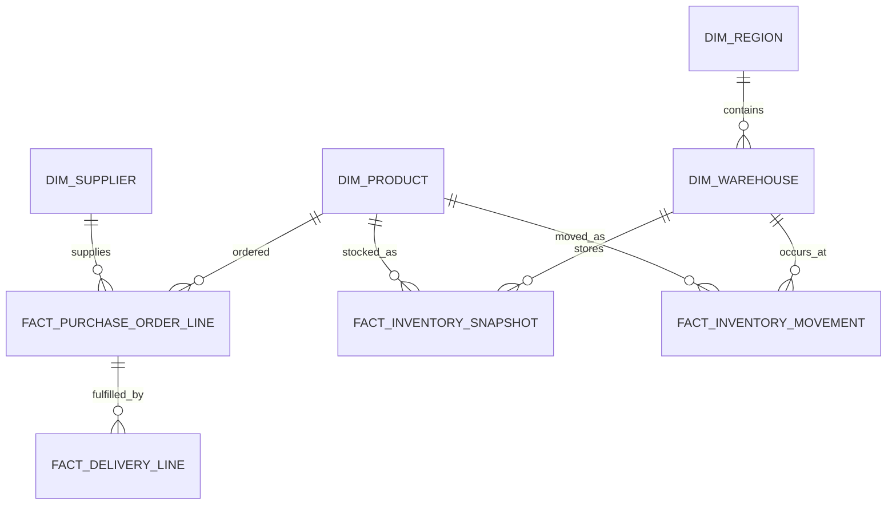

# Data Design and Governance

## 1. Mục đích

Tài liệu quy định cách thiết kế, mô tả, kiểm thử và quản trị dữ liệu cho hệ thống analytics. Nội dung bao gồm data lifecycle, logical model, grain, key, metric contract, data quality, freshness, classification và lineage.

Schema vật lý chỉ được triển khai sau khi logical model được đối chiếu với nguồn dữ liệu thực và được data owner phê duyệt.

## 2. Nguyên tắc

### Khai báo grain trước khi thiết kế fact table

Mỗi fact table phải có một câu mô tả “mỗi dòng đại diện cho điều gì”. Primary key, measure và join phải nhất quán với grain đó.

### Tách dữ liệu nguồn và logic nghiệp vụ

- Raw giữ dữ liệu gần với nguồn và provenance.
- Staging chuẩn hóa tên, type, timezone và lỗi kỹ thuật.
- Mart biểu diễn business process và entity phục vụ phân tích.
- Semantic layer định nghĩa metric, dimension và join được phép.

### Metric là contract có owner

LLM, prompt, UI và ad-hoc query không phải nguồn định nghĩa KPI. Metric chỉ được sử dụng khi có công thức, grain, time dimension, owner, version và test.

### Join phải có cardinality

Mỗi join cần khai báo key, cardinality và điều kiện hợp lệ. Join giữa fact table ở grain khác nhau phải aggregate về grain chung trước khi kết hợp.

### Time semantics phải tường minh

Metric theo thời gian phải xác định event time, timezone, calendar, cutoff, boundary và cách xử lý dữ liệu đến muộn.

## 3. Data lifecycle

| Layer | Repository | Mục đích |
|---|---|---|
| Raw | `data/raw/` | Dữ liệu đầu vào cho local/research, giữ nguyên provenance |
| Staging | `data/staging/` | Chuẩn hóa schema, type, timezone và dedup kỹ thuật |
| Mart | `data/marts/` | Fact/dimension theo business process |
| Seed | `data/seeds/` | Reference data nhỏ và có phiên bản |
| Sample | `data/samples/` | Dataset đã ẩn danh dùng cho test và demo |

Không commit production data, PII, credential hoặc dữ liệu không rõ quyền sử dụng.

## 4. Thuật ngữ

| Khái niệm | Định nghĩa |
|---|---|
| Entity | Đối tượng có định danh dùng trong semantic model và join |
| Dimension | Thuộc tính dùng để group, filter hoặc phân đoạn dữ liệu |
| Measure | Giá trị có thể aggregate tại một grain xác định |
| Metric | Công thức nghiệp vụ có tên, owner, version và policy |
| Grain | Mức chi tiết mà một dòng hoặc một kết quả đại diện |
| Fact | Sự kiện hoặc snapshot có measure và foreign keys |
| Data contract | Cam kết về schema, semantics, quality, freshness và ownership |

## 5. Logical data model

Logical model dưới đây là phạm vi thiết kế ban đầu. Tên, key và grain phải được xác nhận với schema nguồn trước migration đầu tiên.

| Model | Grain | Mục đích |
|---|---|---|
| `dim_supplier` | Một dòng cho một supplier version | Thuộc tính và phân loại supplier |
| `dim_product` | Một dòng cho một product/SKU version | Thuộc tính sản phẩm và category |
| `dim_warehouse` | Một dòng cho một warehouse version | Thuộc tính kho, location và timezone |
| `dim_region` | Một dòng cho một business region | Phân tích và phân quyền theo vùng |
| `fact_purchase_order_line` | Một dòng cho một PO line version hoặc event | Số lượng đặt, ngày đặt và ngày cam kết |
| `fact_delivery_line` | Một dòng cho một delivery/receipt event gắn với PO line | Số lượng và thời điểm giao thực tế |
| `fact_inventory_snapshot` | Một dòng cho product × warehouse × snapshot time | Trạng thái tồn kho tại một thời điểm |
| `fact_inventory_movement` | Một dòng cho một inventory movement event | Giải thích biến động tồn kho |
| `fact_operating_cost` | Grain cần xác định theo nguồn kế toán | Phân tích chi phí vận hành |

### Quan hệ dự kiến



ERD mô tả quan hệ logic, không thay thế foreign key và cardinality test trên dữ liệu thật.

## 6. Model contract

Mỗi model cần metadata sau:

```yaml
name: <model_name>
status: draft | approved | deprecated
description: <business_description>
owner: <team_or_person>
source_owner: <team_or_person>
grain: <one_row_per_description>
primary_key: [<column>]
foreign_keys:
  - columns: [<column>]
    references: <model.columns>
event_time: <column_or_null>
processing_time: <column>
freshness_requirement: <duration_or_policy>
classification: <level>
retention: <policy>
```

## 7. Source inventory

Mỗi source system cần được ghi nhận trước khi ingest:

| Trường | Mô tả |
|---|---|
| Source system | Hệ thống sở hữu dữ liệu |
| Source owner | Người hoặc team chịu trách nhiệm |
| Connection mode | Batch, CDC, API hoặc file |
| Source objects | Bảng, file hoặc endpoint |
| Source grain | Ý nghĩa của một record |
| Keys | Natural, business và technical keys |
| Update cadence | Lịch cập nhật thực tế |
| Freshness requirement | Mức dữ liệu mới cần đáp ứng |
| Classification | Mức nhạy cảm |
| Known issues | Duplicate, null, late update, timezone hoặc mapping issue |
| Reconciliation | Cách đối chiếu với nguồn |

## 8. Source-to-target mapping

| Source field | Target field | Transformation | Business rule owner | Quality test | Status |
|---|---|---|---|---|---|
| Chưa xác định | Chưa xác định | Chưa xác định | Chưa phân công | Chưa xác định | Draft |

Mapping phải được review cùng migration hoặc transformation code. Không thay đổi semantics của source field mà không cập nhật data dictionary và test.

## 9. Data dictionary

Mỗi column trong mart và semantic model cần:

```yaml
name: <column_name>
business_name: <display_name>
description: <business_meaning>
data_type: <warehouse_type>
nullable: true | false
unit: <unit_or_null>
allowed_values: <list_or_reference_or_null>
classification: <level>
masking_policy: <policy_or_null>
source: <source_model.column>
owner: <owner>
quality_tests: []
```

Description phải giải thích ý nghĩa nghiệp vụ, không chỉ lặp lại tên cột.

## 10. Metric contract

Metric được quản lý trong `packages/semantic_layer/metrics/`.

```yaml
name: <metric_name>
version: <version>
status: draft | approved | deprecated
label: <display_name>
description: <business_definition>
business_owner: <owner>
technical_owner: <owner>
base_fact: <model>
base_grain: [<keys>]
metric_type: simple | ratio | derived
expression: <expression_or_metric_references>
aggregation: <aggregation_rule>
time_dimension: <field>
allowed_dimensions: []
approved_joins: []
default_filters: []
null_policy: <rule>
zero_denominator_policy: <rule_or_null>
unit: <unit>
format: <display_format>
freshness_requirement: <policy>
classification: <level>
effective_from: <date>
supersedes: <version_or_null>
tests: []
```

### Metric approval checklist

- [ ] Business definition và formula đã được owner xác nhận;
- [ ] Base grain rõ ràng;
- [ ] Time dimension, timezone và boundary rõ ràng;
- [ ] Null, cancellation, return và zero denominator có policy;
- [ ] Allowed dimensions không tạo fan-out;
- [ ] Có canonical SQL hoặc expected result;
- [ ] Có normal, boundary và negative test;
- [ ] Classification và access scope đã xác định;
- [ ] Version và effective date được ghi lại.

## 11. Join policy

Mỗi approved join cần contract:

```yaml
name: <join_name>
left_model: <model>
right_model: <model>
condition: <qualified_join_condition>
cardinality: one_to_one | one_to_many | many_to_one
allowed_metrics: []
allowed_dimensions: []
owner: <owner>
tests:
  - key_not_null
  - expected_cardinality
  - no_unexpected_fanout
```

Many-to-many join không được đưa vào context generation nếu chưa có bridge strategy và test.

## 12. Time policy

Mỗi model có dữ liệu thời gian cần phân biệt:

- `source_event_at`: thời điểm nghiệp vụ xảy ra;
- `source_updated_at`: thời điểm source cập nhật record;
- `ingested_at`: thời điểm platform nhận record;
- `model_built_at`: thời điểm model được tạo;
- `data_cutoff_at`: cutoff hiển thị cho người dùng.

Các quyết định bắt buộc:

- Timezone lưu trữ và timezone hiển thị;
- Calendar hoặc fiscal period;
- Inclusive/exclusive range boundary;
- Grace period cho late-arriving record;
- Backfill và restatement policy;
- Hành vi khi freshness requirement bị vi phạm.

## 13. Data quality

| Layer | Kiểm tra bắt buộc |
|---|---|
| Source/raw | Schema drift, volume, ingestion timestamp và checksum |
| Staging | Type, key null, dedup, accepted values và timezone normalization |
| Mart | Grain uniqueness, referential integrity, reconciliation và freshness |
| Semantic | Formula, dimension compatibility, join fan-out, null và time policy |
| Serving | Output schema, duplicate grain, value range và freshness |

### Test tối thiểu theo model

| Model | Test |
|---|---|
| Dimension | Business key, uniqueness theo history strategy, status values |
| PO line | Grain, supplier/product relationship, quantity và date consistency |
| Delivery line | Grain, PO-line relationship, quantity và actual date |
| Inventory snapshot | Product-warehouse-time uniqueness, quantity domain và freshness |
| Inventory movement | Movement key, reversal reference và quantity balance |

Failure severity quyết định model bị block, quarantine hay chỉ warning. Ngưỡng phải được data owner phê duyệt.

## 14. History và slowly changing dimensions

Trước khi triển khai dimension cần xác định cho từng attribute:

- Có cần giữ lịch sử hay chỉ giữ giá trị hiện tại;
- Effective start/end và current flag;
- Surrogate key và business key;
- Xử lý source correction và late-arriving dimension;
- Cách fact liên kết đúng dimension version.

Không áp dụng một SCD strategy cho mọi attribute nếu không có yêu cầu nghiệp vụ.

## 15. Data classification và access

Classification scheme phải đồng bộ với policy của tổ chức. Khung ban đầu:

| Mức | Hành vi |
|---|---|
| Public | Có thể hiển thị theo product policy |
| Internal | Chỉ dùng trong hệ thống và nhân sự được phép |
| Confidential | Yêu cầu role/scope, masking và audit |
| Restricted | Deny-by-default; không đưa vào prompt nếu không có phê duyệt riêng |

Access scope được áp dụng trước semantic retrieval và tiếp tục được enforcement tại database. Log, trace, cache, chart, export và feedback store phải tuân theo cùng classification.

## 16. Lineage

Lineage cần truy được theo chuỗi:

```text
Source object
  → ingestion run
  → staging model
  → mart model
  → semantic metric version
  → semantic query plan
  → validated query
  → result checksum
  → final response
```

MVP có thể quản lý lineage bằng metadata versioned và audit event. Khi số lượng pipeline tăng, việc áp dụng một chuẩn lineage cần được đánh giá bằng ADR.

## 17. Change management

Các thay đổi sau cần review và version:

- Grain, key hoặc cardinality;
- Metric formula, filter mặc định hoặc time dimension;
- Allowed dimension hoặc join path;
- Semantics của status/enum;
- Classification hoặc masking;
- Source system hoặc reconciliation rule.

Breaking metric change tạo version mới hoặc migration rõ ràng. Không sửa công thức âm thầm dưới cùng một version.

## 18. Deliverables

- [ ] Source inventory;
- [ ] Logical model và ERD đã review;
- [ ] Grain/key/cardinality matrix;
- [ ] Data dictionary;
- [ ] Source-to-target mapping;
- [ ] Approved join graph;
- [ ] Metric catalog;
- [ ] Seed/sample data đã kiểm tra quyền sử dụng;
- [ ] Data quality suite;
- [ ] Freshness và late-data policy;
- [ ] Classification/access matrix;
- [ ] End-to-end lineage.

## 19. Open questions

- Source systems và data owners;
- Analytics database và SQL dialect;
- Grain chính xác của PO, delivery và operating cost;
- Định nghĩa delivered, late, cancelled, returned và available inventory;
- History strategy cho supplier, product và warehouse;
- Fiscal calendar, timezone và cutoff;
- Freshness requirements;
- Classification, masking và retention;
- Semantic catalog implementation;
- Lineage storage và tooling.

## 20. Standards và tài liệu tham khảo

- [Kimball Dimensional Modeling Techniques](https://www.kimballgroup.com/wp-content/uploads/2013/08/2013.09-Kimball-Dimensional-Modeling-Techniques11.pdf)
- [dbt Semantic Models](https://docs.getdbt.com/docs/build/semantic-models)
- [dbt Data Tests](https://docs.getdbt.com/docs/build/data-tests)
- [OpenLineage Object Model](https://openlineage.io/docs/spec/object-model/)
