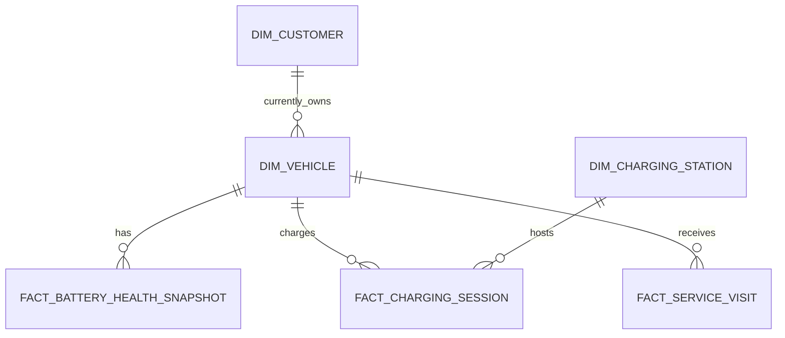

# EV Customer Analytics MVP Schema

Status: Draft  
Technical owner: data-team  
Business owner: unassigned  
Storage: PostgreSQL 17, schema `analytics`  
Data classification: synthetic/internal

## 1. Scope

This schema supports a reproducible Text-to-SQL MVP around synthetic electric-vehicle customers, their current vehicles, battery health, charging behavior and service history. It does not describe a confirmed production schema or contain real customer, VIN, station or operational data.

The schema intentionally contains six physical tables. Raw telemetry, trip-level modeling, ownership history, support cases, payments and application events are later vertical slices.

## 2. Logical model

The customer-to-vehicle relationship represents current ownership only. A vehicle can have zero or one current customer; one customer can have multiple vehicles. Historical transfer of ownership requires a future `bridge_vehicle_ownership` model with effective dates.

## 3. Grain and keys

| Model | Grain | Primary key | Foreign keys |
|---|---|---|---|
| `analytics.dim_customer` | One current row per synthetic customer | `customer_id` | None |
| `analytics.dim_vehicle` | One current row per synthetic vehicle | `vehicle_id` | `current_customer_id → dim_customer.customer_id` |
| `analytics.fact_battery_health_snapshot` | One validated battery observation for one vehicle at one event timestamp | `battery_snapshot_id` | `vehicle_id → dim_vehicle.vehicle_id` |
| `analytics.dim_charging_station` | One current row per synthetic physical charging site | `charging_station_id` | None |
| `analytics.fact_charging_session` | One charging attempt, including completed, failed, cancelled and in-progress attempts | `charging_session_id` | Vehicle and charging-station keys |
| `analytics.fact_service_visit` | One vehicle visit to a service center | `service_visit_id` | `vehicle_id → dim_vehicle.vehicle_id` |

`fact_battery_health_snapshot` additionally enforces uniqueness on `(vehicle_id, observed_at)`. Fact identifiers are stable source/event keys rather than database-generated sequence numbers so a replay can remain idempotent.

## 4. Important column semantics

### Customer and privacy

- `customer_id` is a synthetic token, not a real customer identifier.
- Direct identifiers such as name, email, phone, address and government ID are excluded.
- `age_band` is used instead of date of birth.
- `home_region_code` is coarse and contains no exact location.
- `analytics_consent` exists only to test governance behavior. It is not a legal consent ledger.

### Vehicle and battery

- `vehicle_id` is a synthetic key and must never contain a real VIN.
- `current_customer_id` is nullable for an inventory or currently unassigned vehicle.
- `battery_nominal_capacity_kwh` is the configured nominal capacity of the vehicle.
- `usable_capacity_kwh` is a measured/estimated capacity at snapshot time. Comparing it with nominal capacity is a cross-table data-quality rule rather than a row constraint.
- `battery_pack_key` allows a battery replacement to appear as a new pack on the same vehicle.
- `state_of_charge_pct` and `state_of_health_pct` are percentages in `[0, 100]`.

### Charging

- `started_at` is the charging business-event time used for time filters.
- A completed session must have `ended_at`, `end_soc_pct` and positive delivered energy.
- Failed sessions can deliver some energy before failure and therefore are not forced to zero.
- `cost_amount = 0` means known free charging. `cost_amount IS NULL` means unknown or not applicable; these meanings must not be combined.
- `currency_code` is required whenever a cost is present.

### Service

- A completed visit must have `completed_at`; scheduled and in-progress visits can omit it.
- `customer_paid_amount = 0` is a known zero customer charge, for example a warranty-covered visit.
- `customer_paid_amount IS NULL` means the amount is not yet known or not applicable.
- `is_repeat_issue` is a fixture/source classification for the MVP. A later mart should derive it from an approved issue-matching window.

## 5. Time policy

- PostgreSQL stores all timestamps as `timestamptz`.
- Business reporting uses event columns such as `started_at`, `observed_at` and `opened_at`, never `ingested_at`.
- `source_updated_at` is when the source last changed the record.
- `ingested_at` is when this database received the record.
- Queries use half-open ranges: `event_time >= start AND event_time < end_exclusive`.
- Reports displayed to the lab user default to `Asia/Ho_Chi_Minh`; UTC remains acceptable for storage and interchange.

## 6. Semantic-friendly views

### `analytics.customer_vehicle_overview_v1`

Grain: one vehicle. Battery, charging and service data are reduced to their vehicle grain before joining. This prevents a vehicle with three charging sessions and two service visits from becoming six rows.

### `analytics.charging_session_analytics_v1`

Grain: one charging attempt. It flattens the current customer, vehicle and station dimensions and derives `duration_minutes`. It is suitable for charging metrics without exposing arbitrary join paths to the LLM.

Migration `0004_ev_semantic_marts.sql` adds five single-grain views used by the expanded Week 1 catalog:

| View | Grain | Purpose |
|---|---|---|
| `customer_analytics_v1` | one customer | Includes customers without a vehicle and prevents customer over-counting |
| `vehicle_analytics_v1` | one vehicle | Normalizes current Vehicle360 dimensions |
| `battery_health_analytics_v1` | latest snapshot per vehicle | Supports current SOH descriptions without mixing historical snapshots |
| `service_visit_analytics_v1` | one service visit | Enriches service events with current vehicle/customer attributes |
| `charging_station_analytics_v1` | one station | Separates station count from charging-port count |

The committed SQL fixture remains the database smoke-test source. `scripts/generate_ev_customer_data.py` produces a larger deterministic JSONL dataset under `data/local/generated/` with seed `42`; generated files are intentionally not committed.

## 7. Initial business definitions

These are exercise definitions and require owner approval before their semantic metrics become `approved`.

| Concept | Draft definition |
|---|---|
| Successful charging session | `session_status = 'completed'` and `energy_delivered_kwh > 0` |
| Charging success rate | Successful sessions divided by all completed or failed attempts; cancelled and in-progress sessions are excluded |
| Public charging session | A session whose station has `station_scope = 'public'` |
| Current battery health | Latest valid snapshot by `(vehicle_id, observed_at)` |
| Battery watch candidate | Current `state_of_health_pct < 80`; threshold is a lab assumption |
| Repeat service visit | A completed visit with `is_repeat_issue = true` |
| Active customer | A customer with a currently active vehicle and at least one completed charge or completed service visit in the approved lookback window |

## 8. Required quality tests

- Primary keys are non-null and unique.
- All foreign keys resolve.
- `(vehicle_id, observed_at)` is unique for battery snapshots.
- Percentage and monetary domains satisfy database constraints.
- Completed charging and service records have valid end timestamps.
- Event timestamps do not use ingestion timestamps for reporting.
- Latest `usable_capacity_kwh` does not materially exceed vehicle nominal capacity.
- Battery odometer is non-decreasing within a vehicle, except across an explicitly corrected source record.
- Battery SOH does not increase materially unless `battery_pack_key` changes or a correction is documented.
- Aggregated marts preserve their declared grain and do not fan out.

## 9. Fixture coverage

`data/seeds/ev_customer_mvp_fixture.sql` includes:

- a customer with multiple vehicles and a customer with no vehicle;
- an unassigned inventory vehicle;
- completed, failed, cancelled and in-progress charging attempts;
- charging and service events across day/month boundaries;
- free, billed, unknown and not-applicable charging cost states;
- a battery replacement represented by a changed `battery_pack_key`;
- a low-SOH inactive vehicle;
- a valid missing battery temperature;
- completed, scheduled, cancelled and in-progress service visits;
- a repeated service issue.

## 10. Known limitations and next models

- Current ownership only; no effective-dated ownership history.
- Charging site is modeled without individual charger/connector inventory.
- Service center is currently a code, not a dimension.
- Battery packs are identified through snapshots rather than a separate asset dimension.
- No trip, raw telemetry, customer-support, subscription or application-event models.
- The fixture is deliberately small. A seeded generator should be added when scale and distribution tests begin.

Any change to grain, keys, ownership semantics, event-time policy or business definitions requires a new migration and corresponding semantic/evaluation updates.
